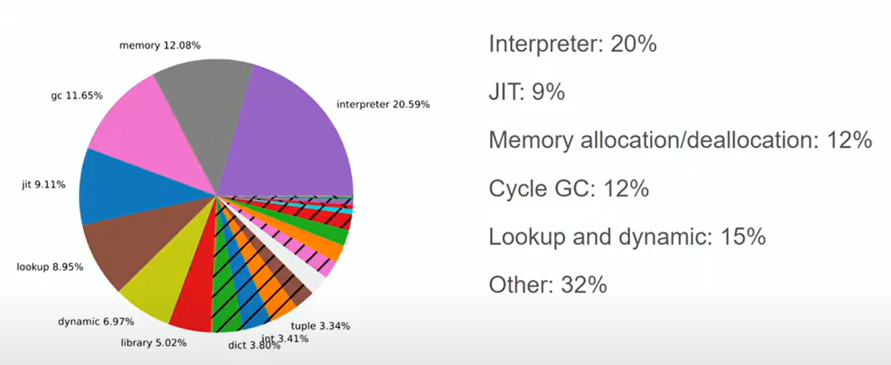
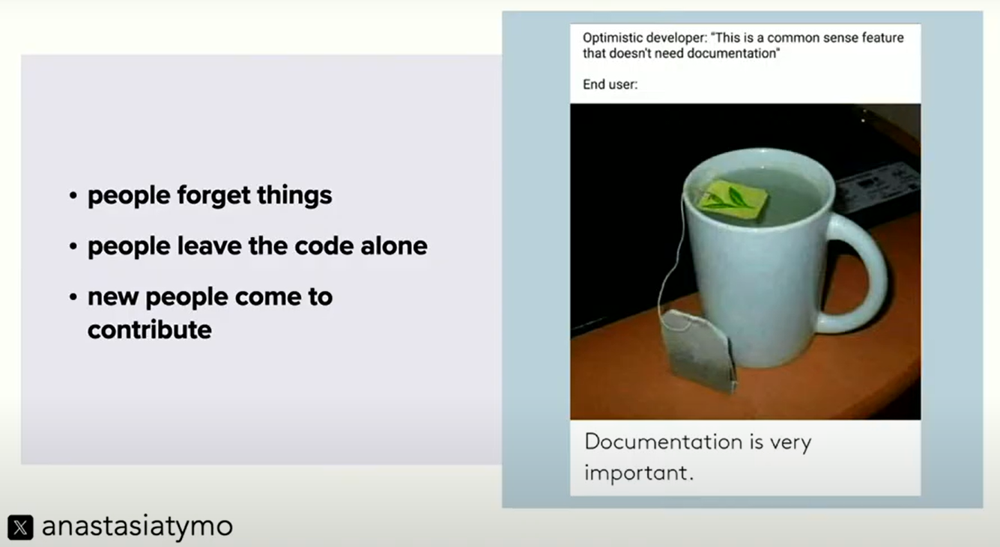

# EuroPython2025
My narrative of EuroPython 2025 in Prague

## General 🧭
- Link to the website: [EuroPython 2025](https://ep2025.europython.eu/)

## Workshops 🛠️
### [Workshop 1: Rambo Python](https://ep2025.europython.eu/session/rambo-python)

Course material: https://github.com/Lenormju/python-royal/tree/english_translation

Mostly the tech stack we use at WSP: uv, ruff, mypy, pytest, pre-commit, ...

Got to play with streamlit a bit, which was fun.

#### Interesting take aways:

- [pydoit](https://pydoit.org/) for task management and cli automation
- [uv custom ca certificates](https://docs.astral.sh/uv/concepts/authentication/#custom-ca-certificates) for possible certificate problems

### [Workshop 2: GIL-free Python and the GPU](https://ep2025.europython.eu/session/gil-free-python-and-the-gpu-hands-on-experience)

Course material: https://learn.nvidia.com/dli-event

See the jupyter notebooks:  [no_gil_gpu.ipynb](Assets/ws2/no_gil_gpu.ipynb)

See the use of NVidia's nvic in [nvic.py](Assets/ws2/nvic.py)

Many tips and tricks on ThreadPoolExecutor and ProcessPoolExecutor both with and without the GIL. Also how to use the GPU with CUDA and Python.

### [Workshop 3: The Mighty Dot - Customize Attribute Access with Descriptors](https://ep2025.europython.eu/session/the-mighty-dot-customize-attribute-access-with-descriptors)

Course material: [mighty_dot.zip](Assets/ws3/mighty_dot.zip)

Very very interesting and well presented workshop by Mike Müller.

#### Take aways:

- A deep dive into properties and descriptors, also alternative ways to implement them.
- How and when to use them? What are the pitfalls?
- There is a WeakKeyDictionary in the `weakref` module to store weak references to objects, which can be useful for caching. Definitely something to look into.

### [Workshop 4: Speaking at EuroPython (or your favorite conference)](https://ep2025.europython.eu/session/speaking-at-europython-or-your-favorite-conference-yes-you-can)

Course material: [Presentation](Assets/ws4/SpeakingAtEuroPythonYesYouCan.pdf)

An interesting workshop on how to prepare a talk for EuroPython or any other conference, lots of tips and tricks.

Also prepared and presented a lightning talk for the first time, which was a fun experience.

## Talks 🎤

Here are some of the interesting talks I attended:

### Keynote: [You don’t have to be a compiler engineer to work on Python](https://ep2025.europython.eu/session/you-dont-have-to-be-a-compiler-engineer-to-work-on-python) by Savannah Bailey

#### Resources: 
- [Slides](Assets/kn/Savannah-Bailey.pdf)
- [Youtube](https://www.youtube.com/watch?v=WGXXxGLBVF4)
- [The home of Python’s code. Follow issues, submit 
PRs, or just watch the repo to learn.](http://github.com/python/cpython)
- [ Docs proposing/explaining major Python changes 
— how and why things work the way they do.](http://peps.python.org)
- [Where high-level discussion happens on features, 
governance, packaging, and ideas.](http://discuss.python.org)
- [ Everything you need to start contributing: setup, 
tools, triage process, testing, and more.](http://devguide.python.org)

#### Take aways:
- Once self-taught developer, now a core python developer.
- Triaging issues is a great way to contribute:
    - Reproducing issues
    - Finding minimum reproducers 
    - Helping categorize issues
    - Suggesting potential fixes
- Updating docs and improving test coverage is also a great way to contribute.
- Do it scared ✨

### Keynote: [Why it took 4 years to get a lock files specification](https://ep2025.europython.eu/session/why-it-took-4-years-to-get-a-lock-files-specification) by Brett Cannon

#### Resources:
- [Slides](https://opensource.snarky.ca/Talks/2025/EuroPython/Slides)
- [Youtube](https://www.youtube.com/watch?v=MMVVboVL5eU)
- [PEP 751 – A file format to record Python dependencies for installation reproducibility](https://peps.python.org/pep-0751/)
- [pylock.toml standard](https://packaging.python.org/en/latest/specifications/pylock-toml/)

#### Thoughts and take aways:
##### Packaging and distribution
- Source distribution (sdist) is the source code of your project. Its format is:
    {project-name}-{version}.tar.gz
- Wheel distribution (wheel) also contains the source code, but bunch of metadata and compiled files. It's a zip file that gets copied "as is" to the environment. Its format is:
    {project-name}-{version}-{python-tag}-{abi-tag}-{platform-tag}.whl
- Please, please, please always include wheel distribution in your releases when pushing to PyPI.
##### Pyproject.toml
- pyproject.toml should at least contain:
    - [project] section with:
        - name
        - version
    - [build-system] section with:
        - requires
        - build-backend
- Don't do upperbounds on your dependencies in pyproject.toml, unless you have a very good reason to do so.
- Use environment markers to specify dependencies for different environments (e.g. for older Python versions).
##### Lock file
- You can have pylock.*.toml file for different purposes, e.g. one for all the newest versions of your dependencies and one for all the oldest versions of your dependencies.
- uv can both create and install from pylock.toml files.

### Keynote: [Behind the scenes of FastAPI and friends for developers and builders](https://ep2025.europython.eu/session/behind-the-scenes-of-fastapi-and-friends-for-developers-and-builders) by Sebastián Ramírez
This is a must watch! Every minute of it is gold 🪙
#### Resources:
- [Youtube](https://www.youtube.com/watch?v=mwvmfl8nN_U)

#### Take aways:
- Focus on solving a problem rather than building stuff.
- Value of newbies (juniors) is great, when it comes to testing, documentation, and user experience.
- Reduce ambiguity in your code, API, and documentation.
- Write good documentation (Documentation Driven Development).
- Premature abstraction is as dangerous as premature optimization.
- Cake vs. Puppy PR: Cake PR is one-time review effort, Puppy PR is an ongoing maintenance effort.
- Your attention is valuable, Not everything deserves your attention.

### Talk: [Teamwork makes the dream work](https://ep2025.europython.eu/session/teamwork-makes-the-dream-work)

#### Resources: 
- [Slides](https://preludetech.github.io/pres-teamwork-europy-2025/)
- [The culture map book](https://www.bol.com/nl/nl/f/culture-map/9300000110083228/): Decoding How People Think, Lead, and Get Things Done Across Cultures.
- [Nonviolent communication](https://www.amazon.nl/-/en/Marshall-B-Rosenberg-PhD/dp/189200528X): Life-Changing Tools for Healthy Relationships
- [On measuring software development productivity](https://www.youtube.com/watch?v=yuUBZ1pByzM)
- [On feedback cycles](https://www.youtube.com/watch?v=Oip7ufMm2Vk)

#### Thoughts and take aways:
- What does good teamwork mean to you?
- Softwate development is a team sport.
    - Skilfully pass the ball and set the next person up for success.
- Put principles above processes.
- Ball passing in software development:
    - Pull requests: make a PR skilfully!
    - Code reviews: give feedback skilfully!
    - Apply feedback skilfully!
    - Ask for help skilfully!
    - Receive help skilfully!
    - Share status regularly!
    - To err is human!
    - To grow is human!
- Good teamwork is good business.
- [Google’s Project Aristotle](https://psychsafety.com/googles-project-aristotle/) found that psychological safety is the most important factor for high-performing teams. Definitely read the article!

### Talk: [How to deal with toxic people](https://ep2025.europython.eu/session/how-to-deal-with-toxic-people)

#### Resources:
- [Slides](Assets/talks/toxic_people.pdf)
- [Burn out by Emily & Amelia Nagoski](https://www.amazon.nl/Burnout-Secret-Unlocking-Stress-Cycle/dp/1984818325)
- [Why zebras don't get ulcers by Robert Sapolsky](https://www.amazon.nl/Zebras-Dont-Ulcers-Revised-Updated/dp/0805073698/)
- [The social contract of open source by Brett Cannon](https://snarky.ca/the-social-contract-of-open-source/)

#### Take aways:
- Understand the types of toxic feedback:
    - Entitlement: "Why is my problem not solved?"
    - Frustration: "Thanks for nothing!"
    - Attack: "🤬 U"
- Coping strategy:
    - Do not engage hot-headedly.
    - Go through your stress respoonse cycle:
    - Cool down
- Open source = No one owes you anything.
- Boundaries:
    - You deserve respect and decency.
    - Have a Code of Conduct and enforce it.
    - Don't accept abuse.

### Talk: [Design Pressure: The Invisible Hand That Shapes Your Code](https://ep2025.europython.eu/session/design-pressure-the-invisible-hand-that-shapes-your-code)

#### Resources:
- [Slides](https://speakerdeck.com/hynek/design-pressure)
- [Blog post by the speaker](https://www.youtube.com/watch?v=IhNSINolcSM&t=2s)
- [PyCon US 2025 version of the talk](https://www.youtube.com/watch?v=IhNSINolcSM)
- [The rising sea (by Mathew Drury) / The harbor coding problem](https://www.youtube.com/watch?v=AkBWb1fK6R8)

#### Take aways:
- Two pieces of code are coupled if they can only be understood by looking at both.
- Testable code is better code.
- The shape of your code should NOT be determined by the shape of your data.
- In software projects, you often have:
    - Database schemas (e.g. SQL tables)
    - API schemas (e.g. what your API sends/receives)
    - Business logic types (e.g. what your app actually works with in memory)
    - ORM models (e.g. how your code talks to the database)
    - These may look similar, but they serve different purposes and have different flexibility needs.
- If you force everything to use the same type (a “franken-type”), the rigid parts (e.g. the database) will limit flexibility everywhere.
    - Some parts (like the database) are harder to change.
    - Others (like your internal app logic) should be easy to change.
- It's better to define separate types in each layer.
    - Then, explicitly map between them (e.g. convert a DB object to an API response).
    - Yes, it’s a bit more work, but it keeps each part clean, flexible, and easy to maintain.
- Start with the `Domain model` based on your business logic:
    - This is the core logic of your app, independent of any external systems.
    - It should be clean, flexible, and easy to change.
- Complexity is not about how many keys I have to press – it’s about how difficult it is to reason about the consequences of what I’m doing.

### Talk: [Intuition vs. Reality: Surprising Truths in Python Performance](https://ep2025.europython.eu/session/intuition-vs-reality-surprising-truths-in-python-performance)

#### Resources:
- [Slides](https://ahaslides.com/codspeed)

#### Thoughts and take aways:
- Performance matters, because:
    - Cost savings
    - Sustainability
    - User experience and adoption
    - Competitive advantage

#### Lessons learned:
Below we handle a series of cases with the same question: Which one is faster?

- ➕ First case, sum(generator) vs len(list comprehension):
    - sum(1 for x in arr if x % 2 == 0)
    - len([x for x in arr if x % 2 == 0])

    - Answer: Context switching between the generator and the list comprehension takes time, so the list comprehension is faster. It uses however much more memory (x10_000).

- 🔡 Second case, concatanating strings with .join() or with +:
    - ''.join(strings)
    - for s in strings: concatanated += s 
    
    - Answer: While using +=, the string is copied into a new larger string instance every time, which is very inefficient. So .join() is much faster. Join pre-allocates the full string size and copies each string once.
    - Built-in functions are usually well optimized, so use them whenever possible.

- 🗝️ Third case, list comprehension vs map():
    - [x * 2 for x in data]
    - list(map(lambda x: x * 2, data))

    - Answer: map() requires a context switch in each iteration to the lambda function (setup, pass arguments and teardown). So eventhough map() is well optimized in C, This operation is faster with list comprehension.

- 🔁 Fourth case, calculating factorial with recursion vs stack appraoch:
    - def factorial_recursive(n):
        if n == 0:
            return 1
        return n * factorial_recursive(n - 1)

    - def factorial_stack(n):
        stack = []
        result = 1
        while n > 0:
            stack.append(n)
            n -= 1
        while stack:
            result *= stack.pop()
        return result

    - Answer: The recursive approach has a lot of overhead due to function calls (pushing frames) and context switching, so the stack approach is faster.

- 🦀 Fifth case, getting x squared in python vs a Rust function:
    - x * x
    - calling rust_square(x) using Rust import from pyo3

    - Answer: This is a real simple operation and Python is very fast at it, so the Rust function is not faster.
    - The overhead of calling the Rust function and converting the types is too high.

- 🦀 Sixth case, Rust fibonacci vs python fibonacci:
    
    - Answer: in Rust, this runs as a native cpu code, purely algorithmic. It is also faster that CPython interpreter bytecode execution. So the Rust version is much faster.

- 🦀 Seventh case, Binary search in Python vs. Rust:
    - in both cases, a list of 10_000 sorted random integers is passed.

    - Answer: Transforming a python list to Rust's Vec is an O(n) operation, while the binary search is O(log n). So the Rust version becomes slower slower and as the list size increases.

- 🦀 Eighth case, Binary search in Python vs. Rust:
    - Now, we pass a pyo3 list to the Rust function and only access log(n) elements in the list directly from memory (so no conversion to Vec).

    - Answer: This is much faster, because we avoid the O(n) conversion to Vec and only access the elements directly from memory. So the Rust version is much faster.

#### Interesting tool:
- [p99](p99.chat) a free performance analysis tool in the browser.

### Talk: [Running every street in Paris with Python and PostGIS](https://ep2025.europython.eu/session/running-every-street-in-paris-with-python-and-postgis)
Interesting talk about processing geographic data.

#### Resources:
- [Slides](https://github.com/vinayak-mehta/2025-europython)

#### Interesting tools:
- [Open street map](https://www.openstreetmap.org/)
    OpenStreetMap (abbreviated OSM) is a free, open map database updated and maintained by a community of volunteers via open collaboration.
- [PostGIS](https://postgis.net/)
    PostGIS is a spatial database extender for PostgreSQL object-relational database. It adds support for geographic objects allowing location queries to be run in SQL.
- [GeoAlchemy 2](https://geoalchemy-2.readthedocs.io/en/latest/)
    GeoAlchemy 2 is an extension of SQLAlchemy for working with spatial databases.
- [gpxpy](https://pypi.org/project/gpxpy/)
    A Python library for parsing and manipulating GPX files. GPX (GPS Exchange Format) is an XML schema designed for transferring GPS data between applications and web services on the internet.
- [Folium](https://python-visualization.github.io/folium/latest/#)
    Folium is a Python library used for visualizing geospatial data. It builds on the data wrangling strengths of the Python ecosystem and the mapping strengths of the Leaflet.js library.

### Talk: [Choosing Between Free Threading and Async](https://ep2025.europython.eu/session/choosing-between-free-threading-and-async)
Nice talk about the pros and cons of threading vs async in the context of free threaded Python.

#### Take aways:
- Use sync when:
    - One CPU is enough
    - Responsiveness doesn't matter
- Use Async when:
    - One CPU is enough
    - Responsiveness matters
- Use Threading when:
    - One CPU core is not enough and the GIL is disabled
    - Or when you have blocking I/O tasks

### Talk: [Performance improvements in 3.14 and maybe 3.15](https://ep2025.europython.eu/session/performance-improvements-in-3-14-and-maybe-3-15) by Mark Shannon
Advanced talk on the performance improvements in Python 3.14 and 3.15.

Resources:
- [Benchmarks](https://github.com/faster-cpython/benchmarking-public/tree/main/profiling)

### Talk: [Continuous Documentation: basics and advanced techniques](https://ep2025.europython.eu/session/continuous-documentation-basics-and-advanced-techniques)
Interesting talk about the importance of documentation, different types of documentation, and how to write and maintain good documentation.

#### Take aways:
- Goal oriented approach:
    - How to guides
- Learning oriented approach:
    - Tutorials
- Understanding oriented approach:
    - Explanations
- Information oriented approach:
    - References
- Tip: Make updating the documentation part of your workflow on CI/CD.

### Talk: [What comes after Rust in the Python ecosystem?](https://ep2025.europython.eu/session/what-comes-after-rust-in-the-python-ecosystem)

#### Resources:
- [Slides](https://github.com/cmaureir/europython2025)

#TODO

### Talk: [What does = do?](https://ep2025.europython.eu/session/what-does-do)

#### Resources:
- [Slides](https://speakerdeck.com/reuven/what-does-equals-do-talk-from-euro-python-2025)

### Talk: [When in practice is Python performance an issue? Facts and myths.](https://ep2025.europython.eu/session/when-in-practice-is-python-performance-an-issue-facts-and-myths)
Eye opening talk about performance myths in Python.
- [Slides](Assets/talks/perf_python_eng_europython_compressed.pdf)

### Take aways:
- Intuition is often wrong. Imaginary knowledge leads to imaginary improvements.
- Measure, don't guess. Act on data, not on hunches.
- We could rely on known datastructures for performance (e.g. dict, list, set), but even then we should measure.
- Being aware of the impact of the code being optimized on the overall performance is crucial. Do not try to solve a micro problem that would lead to a micro benefit.
- Useful tools to profile the code or the tests:
    - cProfile: `python -m cProfile -o output.prof $(which pytest) tests/test_module.py`
    - timeit: `python -m timeit -s "import test_module" "test_module.some_function()"`
    - snakeviz: `snakeviz output.prof`
    - pyinstrument: `pyinstrument -r html tests/test_module.py` plus some additions to the test code.

### Talk: [Broken __slots__ are a silent performance killer—Let's fix them!](https://ep2025.europython.eu/session/broken-slots-are-a-silent-performance-killer-let-s-fix-them)
#TODO

#### Resources:
- [Slides](Assets/talks/__slots__.pdf)

## Cool talks to check out later: 🌟
### [Let's talk: Communication & Consensus Building in Open-Source](https://ep2025.europython.eu/session/let-s-talk-communication-consensus-building-in-open-source)
Amazing talk about organizing (open source) projects, governance, and communication.
- [Slides](https://euro2025.thath.net/)

### [Fearless Automation that Runs Anywhere with Python](https://ep2025.europython.eu/session/fearless-automation-that-runs-anywhere-with-python)
Amazing talk about automation with CI/CD and Python.
- [Slides](Assets/talks/Fearless-Automation-that-runs-anywhere.pdf)

### [A tour of the module `itertools`](https://ep2025.europython.eu/session/a-tour-of-the-module-itertools)
Interesting talk by a fun speaker, Rodrigo Girão Serrão.
- [Slides](Assets/talks/slides_A_tour_of_the_module_itertools_compressed.pdf)

## Lightning Talks ⚡️
### Lightning talk: How to say "No" more easily:
- Rule#1: Don't say "Yes" unless it's been 24 hours since the request.
- Rule#2: Estimate the time, energy and the cost. Then multiply it by 4. Alternatively: make an optimistic estimate, make a pessimistic estimate, then sum them up!
- Rule#3: Future you is gonna be at least as busy as present you.
- Rule#4: Tell your loved one(s) that you are going to say "No" to them by saying "Yes" to the oppurtunity.
- Rule#5: The "honor to be asked" is a trap. Don't fall for it.

### Lightning talk: [How to say PyPI]:
- It's Py (Pie) P (Pee) I (Eye) 😋

## Sessions 🗓️

### Session: [AI discussion panel](https://ep2025.europython.eu/session/ai-discussion-panel)

#### Key take aways:
- AI is a tool, not a replacement for human creativity.
- No AI expert can predict the future. Stop forecasting and definitely stop panicking.

### Session: [CPython Core Development Panel](https://ep2025.europython.eu/session/cpython-core-development-panel)
#TODO

## "Python: the Documentary" 🎬
This is the story of the world's most beloved programming language: Python. What began as a side project in Amsterdam during the 1990s became the software powering artificial intelligence, data science and some of the world’s biggest companies. But Python's future wasn't certain; at one point it almost disappeared.

This 90-minute documentary features Guido van Rossum, Travis Oliphant, Barry Warsaw, and many more, and they tell the story of Python’s rise, its community-driven evolution, the conflicts that almost tore it apart, and the language’s impact on... well… everything. 

Resources:
- [The Documentary](https://www.youtube.com/watch?v=GfH4QL4VqJ0)
- [Q & A](https://www.youtube.com/watch?v=Sf2AqQ5a38Y)

#### Key take aways:
- Transition from Python 2 to Python 3 was very painful: This illustrates the importance of understanding the current ecosystem and the impact of changes on existing users in all digital transitions. Tansition can mean discarding a lot of legacy tools which were made with huge effort and now suddenly are obsolete.
- The importance of inclusivity and community: Python's success is largely due to its welcoming and inclusive community. This highlights the importance of fostering a positive and supportive environment in any community or organization.

## Fun Insights & Highlights 🎉

#### [Take the Python Quiz](https://mathspp.com/blog/python-quiz-europython-2025-edition)

#### The Pac-Man rule

### Interesting tools:
- [Mermaid](https://mermaid.js.org/): A powerful tool to create diagrams and visualizations using text.
- [Obsidian](https://obsidian.md/): A powerful note-taking app that uses markdown files.